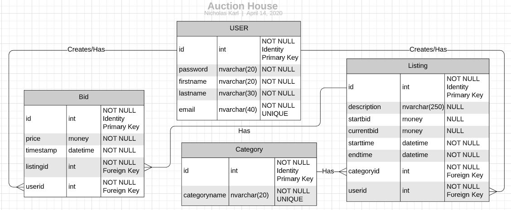

# Auction House Database

## Physical Database Design


This is the database design for the Auction House Application.
The application will create and store data for users, items listed, categories
items belong to, and the bids placed on items listed.

## Database Implementation
### Drop and Create Database
```
USE master;

IF DB_ID(N'KARLAuction') IS NOT NULL DROP DATABASE KARLAuction;

CREATE DATABASE KARLAuction;
GO

USE KARLAuction;
GO
```

## Users Table
This is the Users table which will create and store User information.
Userid will be its' primary key and each account will need a unique e-mail.
```
CREATE TABLE USERS
(
  userid      INT           NOT NULL  IDENTITY,
  password    NVARCHAR(20)  NOT NULL,
  firstname   NVARCHAR(20)  NOT NULL,
  lastname    NVARCHAR(30)  NOT NULL,
  email	      NVARCHAR(40)  NOT NULL
  
CONSTRAINT PK_Users PRIMARY KEY(userid),
CONSTRAINT UNQ_User_email UNIQUE(email)
)
```

## Category Table
The category table is small but will be needed for later to
categorize listings easily. It also contains a Category Name Unique constraint since
there should not be duplicates.
```
CREATE TABLE CATEGORY
(
  categoryid      INT           NOT NULL IDENTITY,
  categoryname    NVARCHAR(20)  NOT NULL,
CONSTRAINT PK_Category PRIMARY KEY(categoryid),
CONSTRAINT UNQ_Category_Name UNIQUE(categoryname)
)
```

## Listings Table
The Listings table will contain two foreign keys from the category and users table and will
break down the listing into an optional description, starting bid, and currentbid. This way
bids can still be placed without a starting parameter. This may be changed later to include defaults.
```
CREATE TABLE LISTINGS
(
  listingid     INT           NOT NULL IDENTITY,
  description   NVARCHAR(250) NULL,
  startbi       MONEY         NULL,
  currentbid    MONEY         NULL,
  starttim      DATETIME      NOT NULL,
  endtime       DATETIME      NOT NULL,
  categoryid    INT           NOT NULL,
  userid        INT           NOT NULL,

CONSTRAINT PK_ListingID PRIMARY KEY(listingid),
CONSTRAINT FK_Category FOREIGN KEY(categoryid)
    REFERENCES CATEGORY(categoryid),
CONSTRAINT FK_Users_id FOREIGN KEY(userid)
    REFERENCES USERS(userid),
)
```
## Bid Table

The bid table will contain information of each bid. It will contain what was the price of the bid,
what listing was it placed on, and who placed the bid. Contains two foreign keys referencing the Listing and Users tables.
```
CREATE TABLE BID
(
  bidid       INT       NOT NULL IDENTITY,
  price       MONEY		NOT NULL,
  timestamp   DATETIME  NOT NULL,
  listingid   INT		NOT NULL,
  userid      INT		NOT NULL
CONSTRAINT PK_BidID PRIMARY KEY(bidid),
CONSTRAINT FK_Users_BID FOREIGN KEY(userid)
    REFERENCES USERS(userid),
CONSTRAINT FK_Listing_id FOREIGN KEY(listingid)
    REFERENCES LISTINGS(listingid),
)
```
